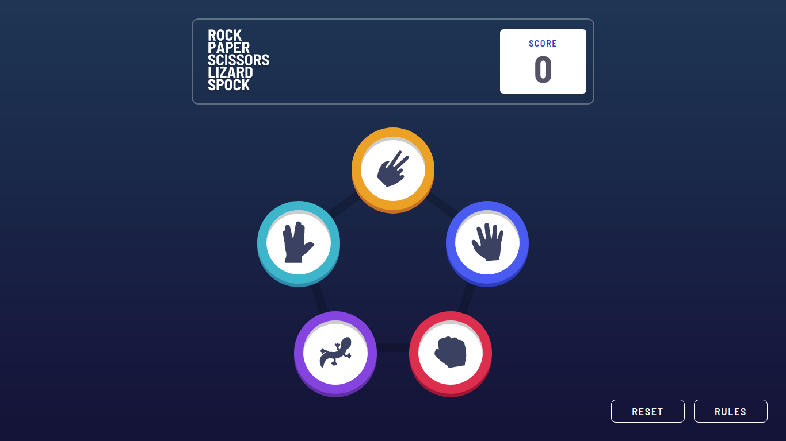
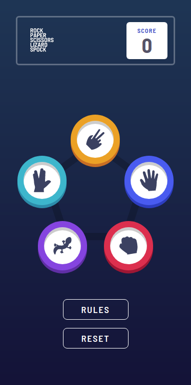

# Frontend Mentor - Rock, Paper, Scissors, Lizard, Spock solution

This is a solution to the [Rock, Paper, Scissors challenge on Frontend Mentor](https://www.frontendmentor.io/challenges/rock-paper-scissors-game-pTgwgvgH).

## Table of contents

- [Overview](#overview)
  - [The challenge](#the-challenge)
  - [Screenshot](#screenshot)
  - [Links](#links)
- [My process](#my-process)
  - [Built with](#built-with)
  - [What I learned](#what-i-learned)
  - [Useful resources](#useful-resources)
- [Author](#author)

## Overview

### The challenge

Users should be able to:

- View the optimal layout for the game depending on their device's screen size
- Play Rock, Paper, Scissors against the computer
- Maintain the state of the score after refreshing the browser _(optional)_
- **Bonus**: Play Rock, Paper, Scissors, Lizard, Spock against the computer _(optional)_

### Screenshot

### Links

- Solution URL: [https://www.frontendmentor.io/solutions/rock-paper-scissors-lizard-spock-game-challenge-sjA0CaEUq](https://www.frontendmentor.io/solutions/rock-paper-scissors-lizard-spock-game-challenge-sjA0CaEUq)
- Live Site URL: [https://gabrielfmpinheiro.github.io/Rock-Paper-Scissors-Lizard-Spock-Game-Challenge/](https://gabrielfmpinheiro.github.io/Rock-Paper-Scissors-Lizard-Spock-Game-Challenge/)

## My process

### Built with

- Flexbox
- CSS Grid
- Mobile-first workflow
- [React](https://reactjs.org/) - JS library
- [Styled Components](https://styled-components.com/) - For styles
- [Tailwind](https://tailwindcss.com/) - For styles

### What I learned

- How to use the react hooks, mainly useState, useEffect and useContext
- More knowledge of positioning elements

### Useful resources

- [Hooks React Doc](https://pt-br.reactjs.org/docs/hooks-intro.htmlm) - This helped me understand more about hooks
- [Grid Course](https://www.youtube.com/playlist?list=PLu8EoSxDXHP5CIFvt9-ze3IngcdAc2xKG) - This is a playlist which helped me to remember some grid concepts
- [React Website Using Styled Components](https://www.youtube.com/watch?v=iP_HqoCuRI0) - This video helped me with some styled component concepts
- [Twin Macro](https://github.com/ben-rogerson/twin.macro) This library helped me to use styled components and tailwind together

## Author

- Linkedin- [Gabriel Pinheiro](https://www.linkedin.com/feed/)
- Frontend Mentor - [@GabrielFMPinheiro](https://www.frontendmentor.io/profile/GabrielFMPinheiro)
- Codewars - [@GabrielFMPinheiro](https://www.codewars.com/users/GabrielFMPinheiro)
